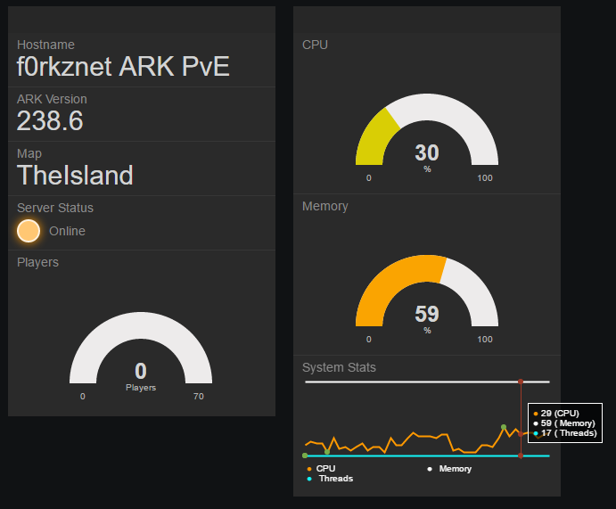

# ARKDaemon: A Python Tool for ARK Dedicated Servers

This tool provides a suite of management tools for your Windows or Linux ARK: Survival Evolved Dedicated Server.

Please read over the README.md file thoroughly as important information is included here.

This tool is currently in development. Please submit issues if any come up!

# News

* 4/10/2016: [Commit c72f655](https://github.com/f0rkz/ARKDaemon/tree/c72f655cfa2b8427907e046f66a9783dc3438caa) Version 0.01 ready for production.
* 4/13/2016: [Commit 930c127](https://github.com/f0rkz/ARKDaemon/commit/930c1279af457ff9e61fc550d2e3e688ae2024f0) Version 0.05 Backup support added. Mods are working now!
* 4/17/2016: Version 0.1 Web API feature added. New configuration options added.

##Currently known issues and untested features:
* Complete map changes from TheIsland may cause your server not to operate. Still need a lot more testing
* Mod install should work but it is currently untested.
* Starting the server from the web api and then closing the web server will cause the ARK server to quit.

# Installation

##Prerequisites
In order to run this script the following needs to be installed:
###Windows
 - python2.7 or higher: https://www.python.org/downloads/
 - pip (should be included in the python installer)
 - Some sort of git integrated with cmd. [I use the program here](https://git-scm.com/download/win).

* Make sure python is configured in Windows PATH Environment

You may also run into an issue with installing package requirements. If you get this error while running:
`pip install -r requirements.txt`:

`error: Microsoft Visual C++ 9.0 is required (Unable to find vcvarsall.bat). Get it from http://aka.ms/vcpython27`

Follow the link and install the msi Microsoft so kindly provided.

###Linux
 - lib32gcc1: `sudo apt-get install lib32gcc1`
 - python2.7 or higher: `sudo apt-get install python python-dev`
 - pip: `sudo apt-get install python-pip`

####Linux System Configuration

ARK Recommends the following settings in your Linux environment. [Click here for more information](http://ark.gamepedia.com/Dedicated_Server_Setup).


Add the following to `/etc/sysctl.conf`

`fs.file-max=100000`

Then run:

`sysctl -p /etc/sysctl.conf`

Add the following to `/etc/security/limits.conf`

      *               soft    nofile          1000000
      *               hard    nofile          1000000

Add the following to `/etc/pam.d/common-session`

`session required pam_limits.so`

You may need to reboot to make sure all of these settings took hold.

## Script Installation

###Step 1:
Clone the [github repository](https://github.com/f0rkz/ARKDaemon):

`git clone https://github.com/f0rkz/ARKDaemon.git`

This will create the directory ARKDaemon. This directory will contain steamcmd, ARK's gamefiles, and everything you
need to run ARK: Dedicated Server.

###Step 2:
Install the python requirements by the usual methods.

`pip install -r requirements.txt`

You may need to run this as root (or administrator for you Windows folks) if you are not using an environment.

##Install steamcmd
Steamcmd is required to install and update gameserver files and mods. In order to initiate steamcmd run the following
command:

`python ARKDaemon.py --install_steamcmd`

##Install ARK
Now you need to init your ARK install. Run the following (it will take a while...)

`python ARKDaemon.py --install_ark`


# Configuration
Configuration for the base server settings is stored in the server.conf file. The provided `server.conf_EXAMPLE` file is
enough information to get your instance running. Copy the `server.conf_EXAMPLE` to `server.conf` and configure your common
ARK settings here.

This file will change over time as the application evolves. Will attempt to notify in commit messages if new options are
added.

#Operating the Server

##Starting the server
`python ARKDaemon.py --start`

##Stopping the server
`python ARKDaemon.py --stop`

This process may take a moment to complete. I suggest running status to see if the server is still running.

##Saving the World File
This will run the saveworld command on the server (needs to be running).

`python ARKDaemon.py --save_world`

##Server Backup
This will copy your current `Mapname.ark` and all the tribe and player profiles to a .tar.gz file that will be accessible in the ARK_BACKUPS directory.

`python ARKDaemon.py --backup`

 or

 `python ARKDaemon.py -b`

##Local Status
This will get some information about the server (if it is running).

`python ARKDaemon.py --status`

Example:

    $ python ARKDaemon.py --status
    Status: Online
    Server Name: f0rkznet ARK PvE
    Server Version: 238.6
    Server Map: TheIsland
    Server Environment: Linux
    Players: 0 / 70
    CPU Usage: 25.0%
    Memory Usage: 56%
    Thread Count: 17

# Web Admin Interface and API
The web portion of ARKDaemon is currently under development. The API is ready to go! Read up on how it works below.

## A handy dashboard
Before the web interface is finished, I suggest hooking the `status` api object into freeboard.io or something similar.
This will enable you to construct a handy at a glance dashboard for your server. *SSL is required by freeboard.io.*



##Running the web interface
`python ARKDaemon.py --web`

or

`python web.py`

##Configuration Options
    [ARK_WEB]
    api_key =
    ssl_crt =
    ssl_key =
    port = 5000

`api_key`: Generated by the script. You can create a key with the `--api_key` option. This key is utilized for the more sensitive api operations.

`ssl_crt`: Read more about this in the SSL Configuration part of the readme.

`ssl_key`: Read more about this in the SSL Configuration part of the readme.

`port`: The port to run the webserver. Default: `5000`

# SSL Configuration
If you require SSL for your API server, drop your server.key and server.crt in the `ssl` directory.

## Getting Keys
[I suggest utilizing letsencrypt for your SSL certificates. It's free!](https://letsencrypt.org/getting-started/)

`./letsencrypt-auto certonly --standalone -d myarkserver.example.com`

This will create the keys as follows:

`/etc/letsencrypt/live/myarkserver.example.com/cert.pem` The certificate PEM.
`/etc/letsencrypt/live/myarkserver.example.com/privkey.pem` The private key.

Copy these into your ssl directory:

`sudo cp /etc/letsencrypt/live/myarkserver.example.com/cert.pem ssl/`
`cudo cp /etc/letsencrypt/live/myarkserver.example.com/privkey.pem ssl/`

Unfortunately for windows users, you are on your own. Get a certificate and key by self-signing or buying a certificate.
Let's Encrypt may have a Windows option, it is worth looking into for the free key.

## Configuration
You need to configure the following options in your `server.conf` file:

    ssl_crt = cert.pem
    ssl_key = privkey.pem

These are the file names of your certificate and key.

# API Documentation
## Server status
Useful status api endpoint to get server information:

`http(s)://your.ip.here:5000/api/status/`

## World Save
Run the saveworld command on the server:

`http(s)://your.ip.here:5000/api/operation/save?key=your_api_key`

## Backup
Backup ARK server:

`http(s)://your.ip.here:5000/api/operation/backup?key=your_api_key`

## Start
Starts the server:

`http(s)://your.ip.here:5000/api/operation/start?key=your_api_key`

One thing to note about starting your server via the web interface:

If you ^C your web console, the server will stop. This is a known bug and a fix is in the works.

## Stop
Stops the server:

`http(s)://your.ip.here:5000/api/operation/stop?key=your_api_key`

# Program Structure

```
ARKDaemon
| ARKDaemon.py: The main script
|____/ARK: Gameserver files contained here. Installed by script. Empty by default.
|____/ARK_BACKUPS: Backup directory.
|____/ssl: Directory containing ssl certificates
|____/ARKDaemon: Modules for ARKDaemon
|____/steamcmd: Steamcmd files
|____/templates: Template files for configurations
```
